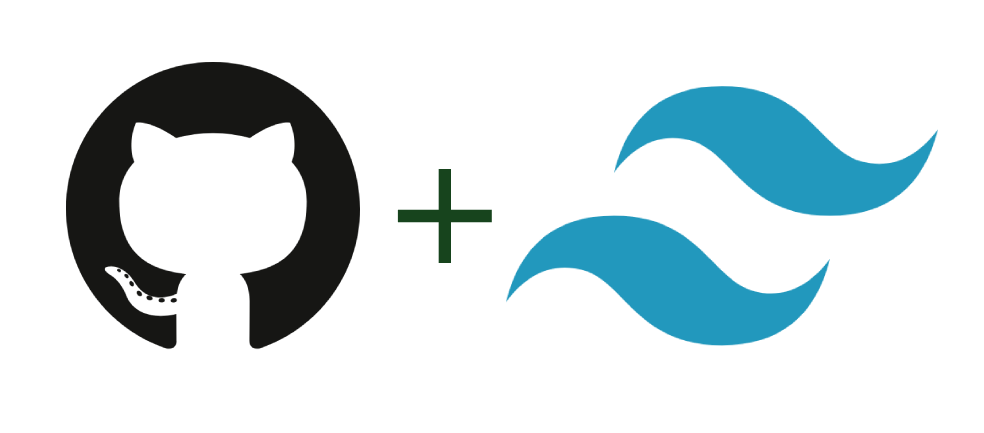

<p align="center">
  <br>
  <a href="https://getresources.ml">
    
  </a>
</p>

<div align="center">
<h1 style="margin-bottom:-10px;">GitWind Portfolio</h1>
A Github themed portfolio template using TailwindCSS
<br>
</div>
<p align="center" style="margin-top:10px;">
  <a title="MIT License" href="LICENSE">
    
  </a>
  
</p>

[](https://vercel.com/new/git/external?repository-url=https://github.com/dntandan/gitwind-portfolio)

## Features

- Dark Theme
- NextJS
- TailwindCSS
- Mobile Friendly


## Demo

- [Demo Site](https://gitwind.ml) - This repository
- [My Personal Demo](https://dntandan.ml)- Production website of my portfolio & Blog


## Installation

Install gitwind-portfolio with yarn

```bash
  yarn install
```

## Run Locally

Clone the project

```bash
  git clone https://github.com/dntandan/gitwind-portfolio
```

Go to the project directory

```bash
  cd gitwind-portfolio
```

Install dependencies

```bash
  yarn install
```

Start the server

```bash
  yarn dev
```

## Contributing

Contributions are always welcome!

See `contributing.md` for ways to get started.

Please adhere to this project's `code of conduct`.

## Deploy on Vercel

The easiest way to deploy your Next.js app is to use the [Vercel](https://vercel.com/) from the creators of Next.js.

